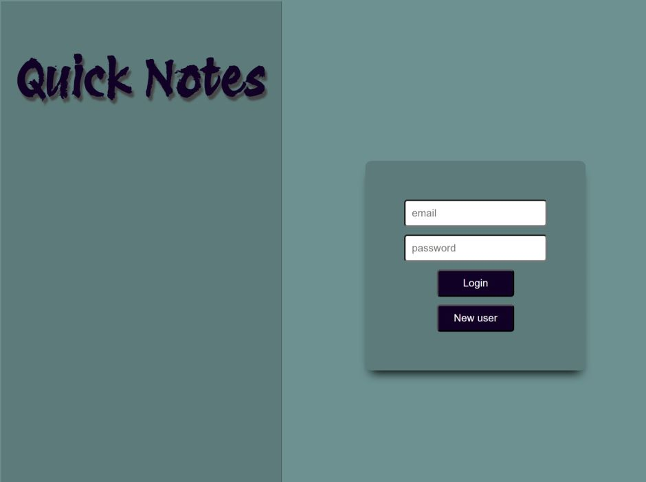
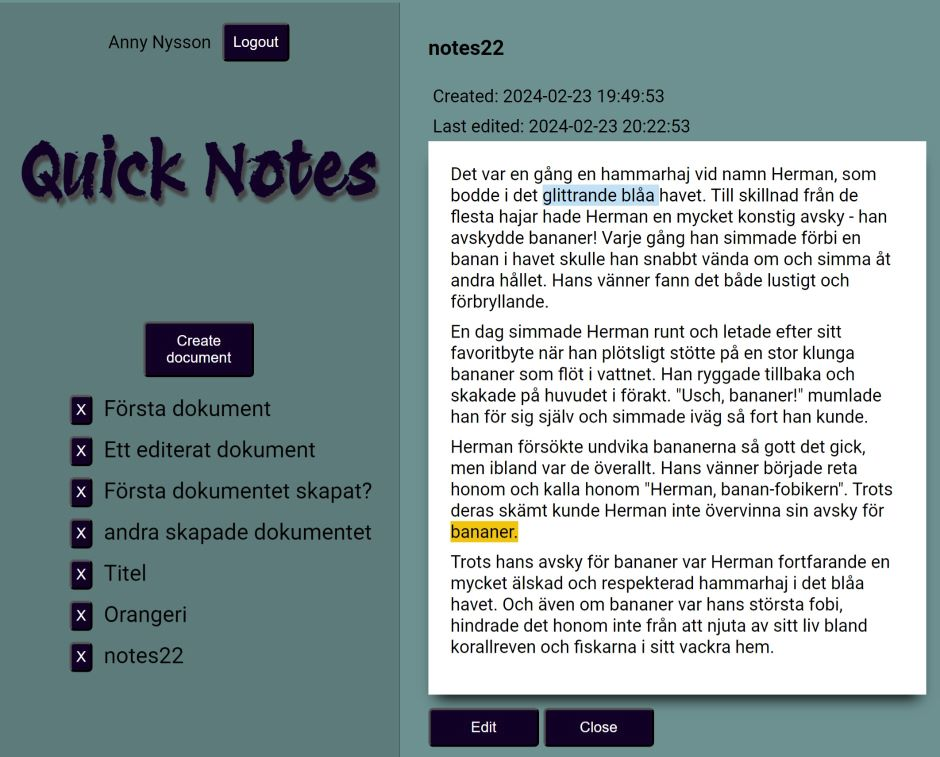
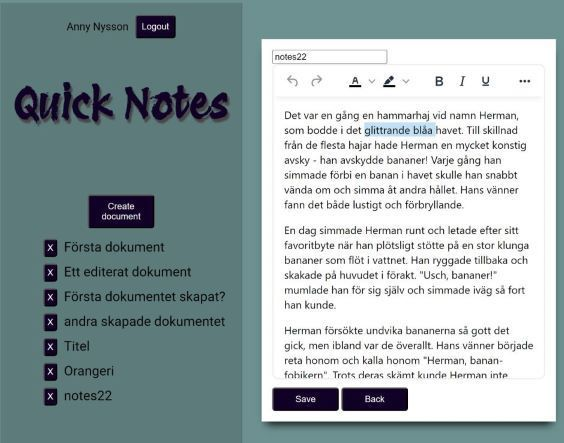
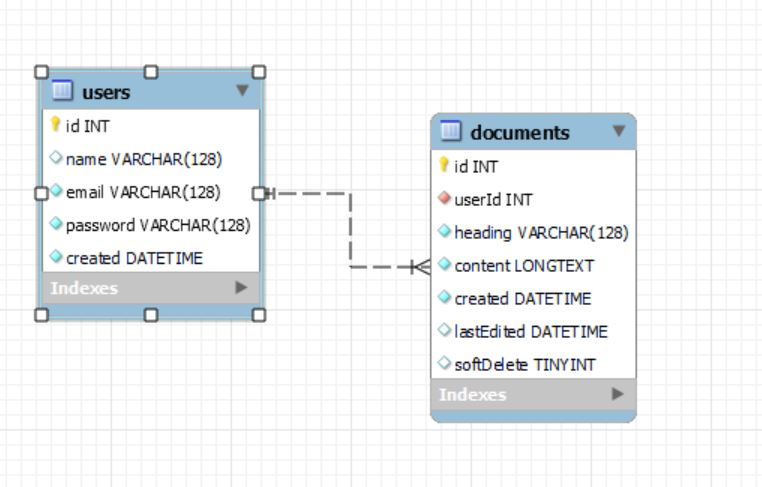

# Project Overview: Notes Document Management System

This project is a document management system built as a demo for a client who wants to create and manage digital documents. The system consists of a frontend and a backend (headless architecture), where users can log in, create, view, edit, and delete documents. The application uses a MySQL database to store documents and user data, and implements full CRUD functionality (Create, Read, Update, Delete).

## Features:
- **User Authentication**: Users can log in and access their documents.
- **Document Management**: Users can create new documents, edit existing ones, and delete them.
- **Editable and View-Only Modes**: Each document can be viewed in both a live mode (without editing) and in an editable mode.
- **WYSIWYG Editor**: A WYSIWYG (What You See Is What You Get) editor allows users to format text, change text color, and adjust the background color of the document.
- **Multi-user Functionality** (VG requirement): Users can create their own accounts and manage their own documents. Users can only view and manage their own documents.

## Technical Details:
- The backend is implemented with Node.js and uses MySQL for the database.
- The frontend is built with a modern JavaScript framework e.g. Vue.js.
- Communication between frontend and backend is handled via a REST API, enabling a clear separation of concerns.
- All user data and documents are stored securely in the MySQL database.

## How to Start the Project:
1. **Backend**: 
   - Navigate to the `/backend` directory.
   - Install dependencies using `npm install`.
   - Configure the database connection in the `.env` file.
   - Start the server with `npm start`.
   
2. **Frontend**:
   - Navigate to the `/frontend` directory.
   - Install dependencies using `npm install`.
   - Start the development server with `npm run dev`.

Make sure to use the provided database dump to initialize the database with sample data for testing.

## Database:
The project includes a MySQL database that stores user information and document data. Users can only access documents they have created. A database schema diagram is included in the documentation to explain the relationships between the tables.

## Credentials:
For testing purposes, the database username and password are documented in the project. Be sure to configure your environment settings before running the project.


## Screenshots








## Built with
 
The project is built using the following:
 

### Frontend
 

 

### Backend

	

 

### WYSIWYG

TinyMCE


## SQL Relations




## Run Locally

Clone the project

```bash
  git clone https://github.com/plugga-tech/notes-Annika-Nyholm-1
```

Go to the project directory

```bash
  cd backend/
```

Install dependencies

```bash
  npm install 
  npx express-generator --no-view
  npm install cors mysql2 dotenv
```

Run database scripts
backend/databse
users.sql
documents.sql

Start the server

```bash
  nodemon start
```

Frontend

```bash
  cd frontend/
```
Install dependencies

```bash
  npm install 
  npm install -g sass
  npm install normalize tinymce
```
Open with live server


